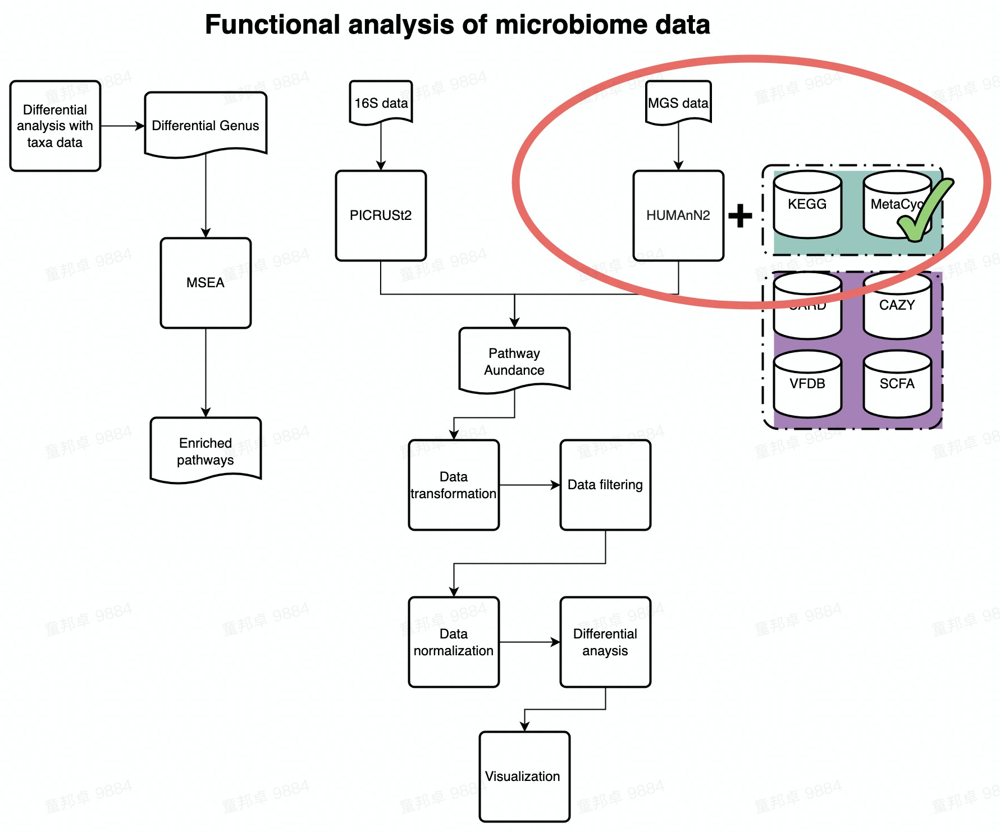

# Functional Analysis of Metacyc database

_**This demo provides guidance to standard data analysis of MetaCyc pathway data. Humman2 is used to annotate MGS reads with MetaCyc database.**_  



---

_**There are five 7 steps in this tutorial:**_  

- Data loading
- Data Preprocess  
- Beta diversity  
- Permanova test  
- Differential analysis  
- Bacteria contribution to pathway  
- Map Reaction(enzyme) and gene to pathway  

---

## Environment setup

_**In this chunk, required packages and functions would be loaded.**_  

```{r load_package,message=FALSE,warning=FALSE}
knitr::opts_chunk$set(warning = FALSE, message = FALSE)

## Remove all libraries and variables in current environment
rm(list = ls())

## Load packages
library(XMAS)
library(xviz)
library(data.table)
library(plotly)
library(xlsx)
library(magrittr)

## Load functions
source("./RScripts/permanova.R")
source("./RScripts/pathway2gene.R")
source("./RScripts/ultility.R")
```

---

## Data loading

_As described in the introduction chapter,_ _**a cohort containing 13 samples of 6 patients in GvHD project**_ _would be used as demo data in this Chapter._  

_**Read metadata:**_  

Read MetaCyc metadata from Demo folder.  

```{r metadata}

metadata <- read.table("./Demodata/MetaCyc/metadata.txt",header = TRUE,stringsAsFactors = FALSE) %>%
  mutate(seqid2 = seqid) %>%  # keep seqid in the metadata
  column_to_rownames("seqid2")

dim(metadata)

head(metadata)

```

_**Read metaphlan2 profile table:**_  

Read MetaCyc profile table from Demo folder.  

```{r load_unstratified_pahtwaydata}

pathwaydata <- read_delim("./Demodata/MetaCyc/merged_relab_pathabundance_unstratified.tsv", delim = "\t") %>%
  mutate(`# Pathway` = str_split_fixed(`# Pathway`, ":", 2)[,1]) %>%           # do not edit 
  column_to_rownames("# Pathway") %>%                                          # do not edit
  t() %>% as.data.frame() %>%                                                  # do not edit
  rownames_to_column("seq_id") %>%                                             # do not edit
  mutate(seq_id=str_extract(seq_id, "\\d{4}")) %>%                             # do not edit 
  filter(seq_id %in% metadata$seqid) %>%                                       # *** only keep samples in metadata, edit if needed ***
  column_to_rownames("seq_id")   %>%                                           # do not edit
  t() %>% as.data.frame() %>%                                                  # do not edit
  rownames_to_column("pathway") %>%                                            # do not edit
  filter(rowSums(.[,-1]) > 0) %>%                                              # do not edit
  column_to_rownames("pathway")                                                # do not edit

dim(pathwaydata)
```

---

## Data preprocess

_**Transforming data**_  

In this chunk, we use TSS (Total sum scaling) to eliminate the influence of sequencing depth on samples.  

```{r TSS of MetaCyc data}

rescaled_pathwaydata <- pathwaydata %>% apply(., 2, function(x) x/sum(x)) %>% as.data.frame()

dim(rescaled_pathwaydata)

```

_**Remove unppaed pathways**_  

Note: you need to transform your data into relative abundance before running this chunk!!  

```{r filtering}

rescaled_pathway.clean <- rescaled_pathwaydata %>% 
  rownames_to_column("pathway") %>%
  filter(!pathway %in% c("UNMAPPED","UNINTEGRATED")) %>%
  column_to_rownames("pathway")

dim(rescaled_pathway.clean)
```

_**Aggregate low abundance data**_  

In this chunck, we aggregate low abundance features to one row. **Notably, you need to transform and remove unmapped entries in your data before running this chunk!!**  

_1e-12 is an empirical threshold fot filtering low abundance feature. According to published paper [Obese Individuals with and without Type 2 Diabetes Show Different Gut Microbial Functional Capacity and Composition](https://doi.org/10.1016/j.chom.2019.07.004)  
pathway with top 50% mean abundance and top 50% variance are left. But in MaAsLin2，pathway with abundance less than 10-10 are filtered by default._  


```{r aggregate}

pathway.clean <- aggregate_low_abundance(input_data = rescaled_pathway.clean,
                                                           threshold = 1e-12) ## threshold should be modified based on your on study

dim(pathway.clean)
```

---

## Plot Beta diversity  

In this demo, we plot PCoA with Bray-Curtis distance as example.  
plot_beta_diversity is a fucntion in XVIZ working on calculating the beta diversity distance and visualzing output. Input of plot_beta_diversity should be a phyloseq object.  

```{r beta_diversity,fig.width=12}

phyloseq(otu_table(pathway.clean, taxa_are_rows = T), sample_data(metadata)) %>%
  plot_beta_diversity(feature = "Group",add_pc1 = TRUE, add_pc2 = TRUE)

```

---

## Permanova test  

run_permanova_betadisp is a function in XMAS working on doing dispersion test and PERMANOVA test.  
The first output is dispersion test and the second output is PERMANOVA test.  

```{r permanova_test}

phyloseq(otu_table(pathway.clean, taxa_are_rows = T), sample_data(metadata)) %>%
  run_permanova_betadisp(vars = "Group")

```

---

## Differential analysis(DA)  

_**Filter low prevalence pathway**_  

In this chunk, we would remove pathways apperaing in less than max(2 , 5% of samples) from data set before doing analysis. **Remember to run all three chunks in data preprocessing section before running this chunk!**  

```{r filter_prevalance}

pathway.filter <- XMAS::filter_prevalence(otu_table = pathway.clean,
                                    metadata = metadata.clean,
                                    threshold = 0.05,
                                    taxa_are_rows = TRUE)

dim(pathway.clean)
dim(pathway.filter)

```

_**LefSE**_

**Remember to filter_prevalance in the chunk above before running this chunk!**  

```{r lefse}
da_pathway =  phyloseq(otu_table(pathway.filter, taxa_are_rows = T), sample_data(metadata)) %>%
  lefse_mgs(compvar = "Group") %>% 
  .$DA_features


da_pathway$id %<>% str_replace_all("_","-")
```

---

## Bacteria contributing to differential pathways  

```{r bacteria_contribution, fig.width=7,fig.width=7}
options(stringsAsFactors = FALSE)

pathway_stratified <- read_delim("./Demodata/MetaCyc/merged_relab_pathabundance_stratified.pcl", delim = "\t") %>%
    column_to_rownames("pathwayID") %>%
    t() %>%
    as.data.frame() %>%
    rownames_to_column("seq_id") %>%
    mutate(seq_id=str_extract(seq_id, "\\d{4}")) %>%
    filter(seq_id %in% metadata$seqid) %>%
    column_to_rownames("seq_id") %>% 
    t() %>%
    as.data.frame() %>%
    .[apply(.>0, 1, any),] %>%
  #  .[apply(.>0,1, function(x) sum(x) > 4),] %>%
    rownames_to_column("pathwayID") %>%
    mutate(PathwayID=str_split_fixed(pathwayID,":",2)[,1]) %>%
    mutate(Introduce=str_split_fixed(str_split_fixed(pathwayID,":",2)[,2],"\\|",2)[,1]) %>%
    mutate(Genus=str_split_fixed(str_split_fixed(pathwayID,"\\|",2)[,2], "\\.", 2)[,1]) %>%
    mutate(Species=str_split_fixed(str_split_fixed(pathwayID,"\\|",2)[,2], "\\.", 2)[,2]) %>%
    mutate(Species=str_replace(Species, "s__", ""))

pathway_list <- pathway_stratified %>% as.data.frame() %>%
    dplyr::select(PathwayID, Species) %>%
    filter((!str_detect(PathwayID, "UNINTEGRATED"))  & (PathwayID %in% da_pathway$id) & Species!="") %>%
    pivot_wider(names_from = "Species",values_from = "Species") %>%
    column_to_rownames("PathwayID") %>% .[apply(.,1,function(x) sum(!is.na(x))) >= 2,] %>%
    rownames()
    

read_delim("./Demodata/MetaCyc/merged_relab_pathabundance_stratified.tsv", delim = "\t") %>%
    column_to_rownames("# Pathway") %>%
    t() %>%
    as.data.frame() %>%
    rownames_to_column("seqid") %>%
    mutate(seqid=str_extract(seqid, "\\d{4}")) %>%
    merge(metadata,.,  by="seqid") %>%
    filter(seqid %in% metadata$seqid) %>%
    column_to_rownames("seqid") %>%
    t() %>%
    as.data.frame() %>%
    rownames_to_column("pathwayID") %>%
    write.table(.,"./output/MetaCyc/merged_relab_pathabundance_stratified.pcl", row.names = FALSE, quote = FALSE, sep = "\t")

for (i in pathway_list) {
    commond_text <- "python3.5 ~/tongbangzhuo_Xbiome1/Script/humann2_barplot.py --input ./output/MetaCyc/merged_relab_pathabundance_stratified.pcl --focal-feature ${pathwayID} --focal-metadatum Group --last-metadatum Group -d 8 4 --output output/MetaCyc/${pathwayID}.png -e 0.8"
    commond_text <- stringr::str_interp(commond_text, list(pathwayID = i))
    system(commond_text)
}

```

---

## Plot Bacteria contribution

```{r plot_bacteria_contribution}

image_path <- NULL

image_path <- system('ls ./output/MetaCyc/*PWY*png', intern = TRUE) %>% unlist() %>% as.character() %>% as.vector() %>% .[1:5]

## In the graph(s) below, green KO are those KOs enriched in GroupB, red KO are those KOs enriched in GroupA
knitr::include_graphics(image_path)

```

---

## Gene and Ensyme involed in differential pathways  

_**load tables to mapping pathway to gene and enzyme**_  

```{r load_metacyc_data}

# gene family
my_genefamily = read.table("./Demodata/MetaCyc/all.genefamilies.tsv",sep="\t")
my_genefamily_unstratified = my_genefamily %>% filter(!str_detect(V1,"[|]"))

metacyc_pwy_name = read_delim("./Demodata/MetaCyc/map_metacyc-pwy_name.txt",delim = "\t",col_names = FALSE)

```

_**Mapping pathway to related gene and reaction**_  

```{r gene_ensyme}

cur_path = 1
append_option = TRUE
da_pathway_gene_full_list = list()


for(i in 1:length(pathway_list)){
  pathway_gene_result = pathway2gene(pathway_list[i])

  if(is.null(pathway_gene_result)){
    cur_path = cur_path+1
    next()
  }

  else{
    pathway_gene_result = pathway_gene_result %>% dplyr::filter(genefamily %in% my_genefamily$V1)

  if(cur_path == 1){
    append_option = FALSE
  }

  if(cur_path > 1){
     append_option = TRUE
  }

  da_pathway_gene_full_list[[pathway_list[i]]] = pathway_gene_result

  cur_path = cur_path + 1
  }

}


```

_**Show the result of one of the differential pathways for example:**_  


```{r pathway_reaction_gene_example}

head(da_pathway_gene_full_list[[1]])

```

---

## Session info

```{r}
devtools::session_info()
```
