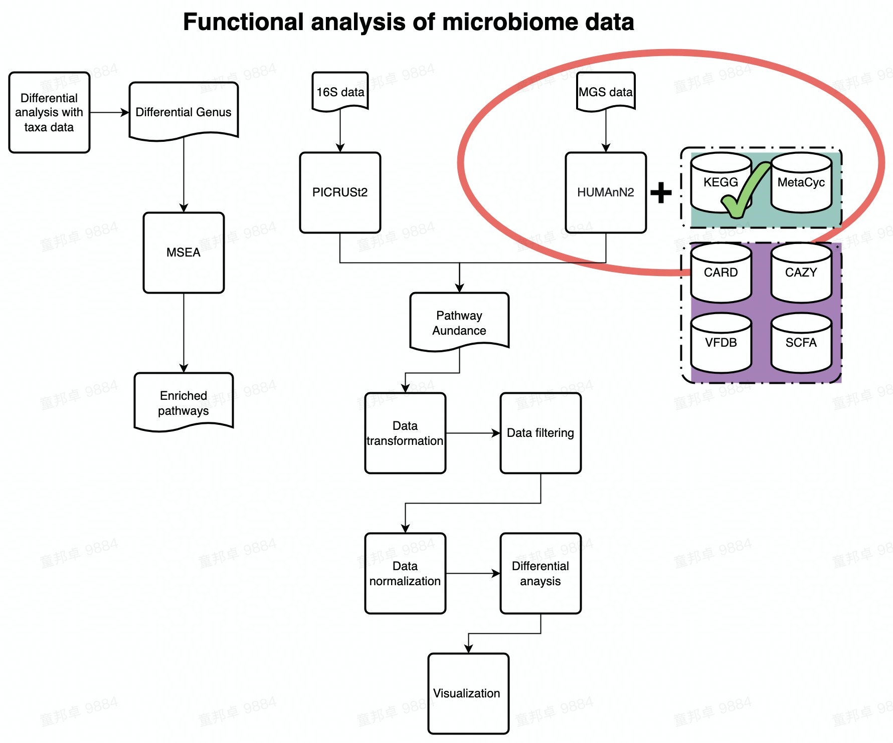

# Functional Analysis of KEGG

(This script was written in _**/share/projects/SOP/Functional_Analysis/github/Functional_analysis/**_ , all relative paths below are under this complete path.)

_**This demo guides you how to analyze KEGG pathway profile and KO profile.**_  



---

## Environment setup

```{r environment setup for kegg analysis, echo=FALSE, message=FALSE}
knitr::opts_chunk$set(echo = TRUE)

## Load requeired packages
library(tibble)
library(phyloseq)
library(stringr)
library(xviz)
library(reshape2)
library(magrittr)
library(dplyr)
library(pathview)

options(stringsAsFactors = FALSE)

## Load functions
source("./RScripts/ultility.R")
```

---

## Data loading

Here we use example data from Functional_Analysis_Kegg_Pathway_preprocess.Rmd and demo metadata created from Create_Demo_Metadata.

- ./Demodata/KEGG/Demo_data/merged_pathway.txt.  rows are pathways, columns are samples.
- ./Demodata/KEGG/Demo_data/Demo_metadata.xls.  rows are samples, columns are group info.

```{r read input}
## Some pathway ID start with 0, thus we need to read in first column as character object.

pathway_profile_tbl <- read.table('./Demodata/KEGG/Demo_data/merged_pathway.txt',header = TRUE, comment.char = '!', stringsAsFactors = FALSE , colClasses = c('# Gene Family' = 'character'), na.strings = '', sep='\t', check.names = FALSE)

## We can map pathway ID to pathway names with the mapping file in minpath.
## But it is not suggested to do the mapping in this step, because pathway names contain species characters, but we read in mapping file here anyways.

ID2Name_mapping_tbl <- read.table('/share/work/runtime/softwares/MinPath/data/KEGG-pathway.txt', header = FALSE, na.strings = '', comment.char = '', sep = '\t', colClasses = c('V1' = 'character'))

colnames(ID2Name_mapping_tbl) <- c('PathwayID', 'Label')


## Next we read in metadata (Group information)
metadata <- read.table('./Demodata/KEGG/Demo_data/Demo_metadata.xls', check.names = FALSE, header = TRUE)
metadata %<>% column_to_rownames('sample') %>% as.data.frame()
```

---

## Data preprocessing

_**Remove the pathways whose abundance are 0 across all samples**_

```{r remove 0-abundance pathways}
## If we use harmonic mean or median to calcualte pathway abundance from KOs, the pathway abundance may be 0, we therefore need to remove those pathways having 0 abundance across all samples.
## Sample 14295 is water, don't panick when you see loads of 0s in your data, check the sample source when you see weird numbers in profile table.

pathway_profile_tbl %<>% column_to_rownames('# Gene Family') %>% dplyr::filter(rowSums(.) > 0)

```

_**Transforming data**_  

```{r TSS}
## In this chunk, we use TSS (Total sum scaling) to eliminate the influence of sequencing depth on samples. After re-scaling, we can apply DA to samples.

rescaled_pathway_profile_tbl <- pathway_profile_tbl %>% apply(., 2, function(x) x/sum(x)) %>% as.data.frame()

head(rescaled_pathway_profile_tbl)
nrow(rescaled_pathway_profile_tbl)
```

_**Remove unppaed pathways**_  

```{r remove unmapped entry}
## In this chunk, we remove the umapped row in rescaled profile table because we are not able to intepret UNMAPPED entry.

rescaled_pathway_profile_tbl %<>% t() %>% as.data.frame() %>% dplyr::select(!UNMAPPED) %>% t() %>% as.data.frame()

```

_**Aggregate low abundance data**_  

In this chunck, we aggregate low abundance features to one row.  
_**1e-12 is an empirical threshold fot filtering low abundance feature. According to published paper [Obese Individuals with and without Type 2 Diabetes Show Different Gut Microbial Functional Capacity and Composition](https://doi.org/10.1016/j.chom.2019.07.004), pathway with top 50% mean abundance and top 50% variance are left. But in MaAsLin2，pathway with abundance less than 10-10 are filtered by default.**_  

```{r Filter low abundance pathway}

filtered_pathway_RA_profile_tbl <- aggregate_low_abundance(input_data = rescaled_pathway_profile_tbl,
                                                           threshold = 1e-12) ## threshold should be modified based on your on study

dim(filtered_pathway_RA_profile_tbl)
```

---

## Standard Analysis

_**Compositional barplot**_

```{r Compositional barplot of kegg pathway, fig.width = 6, fig.height = 9}
## In this chunk, we construct stacked pathway barplot to depict the pathway composition of samples, we use function plot_stacked_bar from xviz to plot.
## In case there are too much entries, we use parameter "collapse" in plot_stacked_bar function to integrate entries whose abundance are below given threshold into "Others".
## Note: make sure your graph is long enough to show the group information.

pathway_stacked_barplot  <- xviz::plot_stacked_bar(otu_table = filtered_pathway_RA_profile_tbl %>% t() %>% as.data.frame(),
                 metadata = metadata, collapse = 1e-3, feature = 'group')

print(pathway_stacked_barplot)
```

_**Beta diversity**_

```{r Beta diversity of kegg pathway }
## In this chunk, we inherit the concept of Beta diversity of microbial taxa data and apply it to pathway data to explore the similarity between samples.
## construct phyloseq for beta diversity analysis

phy <- phyloseq(otu_table(filtered_pathway_RA_profile_tbl, taxa_are_rows = TRUE),
                sample_data(metadata))

## PCOA plot with bray_curtis distance
PCOA_plot <- xviz::plot_beta_diversity(phyloseq = phy,
                                       feature = 'group',
                                       method = 'bray',
                                       label = TRUE)
print(PCOA_plot)

## PERMANOVA test & beta dispersion test
## We use PERMANOVA test to check the differences of function composition among different groups. Additionally, we also take homogeneity of group variance into consideration.

dispersion_permanova_res <- run_permanova_betadisp(physeq = phy,
                                                   vars = 'group'
                                                   )

dispersion_permanova_res
```

---

## Differential analysis(DA)

_**Filter low prevalence pathway**_  

Low prevalence pathways are pathways only occur in minor samples.
In this chunk, we would remove pathways apperaing in less than max(2 , 5% of samples) from data set before doing analysis. **Remember to run all three chunks in data preprocessing section before running this chunk!**  

```{r Filter low prevalence pathway of KEGG data}

filtered_pathway_RA_profile_tbl <- filter_prevalence(otu_table = filtered_pathway_RA_profile_tbl,
                  threshold = 0.05,
                  taxa_are_rows = TRUE
                  )

dim(filtered_pathway_RA_profile_tbl)
```

_**DA with LM**_

```{r DA of kegg pathway data}
## In this chunk, you would be using logistic regression model to find pathways that are significantly enriched in certain group.

## Due to the nature of compositional data, we cannot apply linear models to compositional data directly. 
## Transformation of relative abundance data should be carried out before feeding the data to LM.
## Here, we add a very small value (1e-12) to the pathway profile table to avoid genrating NA during transformation, then use logit transformation to transform data. And eventually we apply LM to the transformed data

## Adding small value to the profile table (The value is arbitrary).

DA_pathway_RA_profile_tbl <- filtered_pathway_RA_profile_tbl + 1e-12

## Reshape profile data table and use logit transformation.

DA_pathway_RA_profile_tbl <- DA_pathway_RA_profile_tbl %>% t() %>% as.data.frame() %>% rownames_to_column('SeqID') %>% as.data.frame()
DA_metadata <- metadata %>% rownames_to_column('SeqID') %>% as.data.frame()

## Reshape dataframe into long table
DA_input <- merge(DA_pathway_RA_profile_tbl, DA_metadata, by='SeqID') %>% reshape2::melt(value.name = 'RA',
                                                                                         variable.name = 'PathwayIDs')

## Logit transformation
DA_input %<>% mutate(RA_logit = log(RA/(1-RA)))

## Fit data to LM
## Loop over each pathway in two groups
LM_res <- DA_input %>%  split(.$PathwayIDs) %>% lapply(., function(x){
  gml_res_summary <- lm(data = x, formula = RA_logit ~ group) %>% summary() %>% .$coefficients %>% as.matrix() %>% as.data.frame() %>% rownames_to_column(var = "Factors")
  }
)

## Merge all result in one table
LM_res <- LM_res %>% data.table::rbindlist(idcol = "PathwayID") %>% filter(Factors != "(Intercept)")

## Adjust p value using p.adjust function from stats package, you could choose different adjust method.
LM_res %<>% mutate(adjust.p  = stats::p.adjust(.$`Pr(>|t|)`,
                                               method = 'BH'))

## Calculate effect size (Odds ratio) of each feature
LM_res %<>% mutate(OR = exp(Estimate)) %>% as.data.frame()

## Add label to pathwayIDs

LM_res %<>% merge(., ID2Name_mapping_tbl, by = 'PathwayID')
```

_**Show DA result with volcano plot**_

```{r visualize DA result by volcano plot of KEGG pathway data}
## Plot volcano plot to show effect size (x-axis) and p value (y-axis) of pathways.
## Here we only tend to hightlight pathways that satisfy adjust.p < 0.614 and (OR < 0.2 | OR > 0.5) at the same time.
## You can nevertheless choose different threshold accroding to your own data.

volcano_plot <- LM_res %>% mutate(p.adj.log = -log10(adjust.p), log10OR = log10(OR)) %>%
    ggplot(aes(x = log10OR, y = p.adj.log)) +
    geom_point(size = 0.5) +
    geom_point(size = 0.5, color = "red", data = . %>% filter(adjust.p < 0.614 & (OR < 0.2 | OR > 0.5))) +
    #geom_text_repel(size = 6/.pt, aes(label = Label), data = . %>% filter(adjust.p<0.614 & OR<0.2)) +
    geom_vline(xintercept = log10(c(0.05, 0.1, 0.2, 0.5, 1, 2)), size = 0.05, color = "grey") +
    geom_hline(yintercept = -log10(c(0.7)), size = 0.05, color = "grey") +
    theme(aspect.ratio = 1,
          panel.grid.minor = element_blank(),
          panel.grid.major.x = element_blank()
          ) +
    labs(x = "Estimated Odds Ratio", y = "FDR adjusted p-values(-log10)")

print(volcano_plot)

```

_**Show DA result with pathview**_

In this chunk, we use pathview to visualize enriched KOs in differential pathways.  

**Step1. First we extract all KOs in differential pathways obtained from last chunk with mapping file: /share/work/runtime/softwares/MinPath/data/KEGG-mapping.txt.**  

**Step2. We find differential KO in two groups using the same LM method in previous chunk.**  

**Step3. Visualize differential KO in differential pathways with pathview.**  

```{r visualize DA result by kegg map}

## Read in KO profile, since we've already removed UNMAPPED and re-scaled KO profile in Functional_Analysis_Kegg_Pathway_preprocess.Rmd, we only need to filer low_abundance and low-prevalenece KOs here.

KO_profile <- read.table('./Demodata/KEGG/Demo_data/merged_knumber.txt')

## Add hearder to KO profile, because KO profile file generated from Functional_Analysis_Kegg_Pathway_preprocess.Rmd has no headers by default.

header <- read.table('./Demodata/KEGG/Demo_data/merged_pathway.txt',header = TRUE, comment.char = '!', stringsAsFactors = FALSE , colClasses = c('# Gene Family' = 'character'), na.strings = '', sep='\t', check.names = FALSE) %>% colnames()

header[1] <- 'KOs'

colnames(KO_profile) <- header
 
## Rescale KO profile

KO_profile %<>% column_to_rownames('KOs') %>% apply(., 2, function(x) x/sum(x)) %>% as.data.frame() %>% rownames_to_column('KOs')

## Filter low abundance KOs

filtered_KO_profile <- KO_profile %>% column_to_rownames('KOs') %>% aggregate_low_abundance(input_data = .,
                                                           threshold = 1e-12)

## Filter low-prevalenece KOs

filtered_KO_profile <- filter_prevalence(otu_table = filtered_KO_profile,
                  threshold = 0.05,
                  taxa_are_rows = TRUE
                  )

## Read in KO-Pathway mapping file
KO2Pathway_mapping <- read.table('/share/work/runtime/softwares/MinPath/data/KEGG-mapping.txt', colClasses = c('V1' = 'character'))


## Loop over differential pathways
Diff_pathway <- LM_res %>% filter(`Pr(>|t|)` < .05) %>% .$PathwayID %>% as.vector()

for (pathway in Diff_pathway){
  
  ## Create a list to store the log2fc of each KO in each kegg pathway
  log2fc_list <- list()
  
  ## Extract all KOs in differential pathway
  KO_ID_in_mapping <- KO2Pathway_mapping %>% filter(V1 == pathway) %>% .$V2
  
  ## Some KOs are not included in mapping file, here we take intersection of KO ID in mapping file and avaiable KO ID in KO profile
  KO_ID <- intersect(KO_ID_in_mapping, rownames(filtered_KO_profile))
  
  tmp_KO_profile <- filtered_KO_profile[KO_ID,]
  tmp_KO_meta <- DA_metadata
  
  ## re-format tmp KO profile table
  KO_DA_input <- merge(tmp_KO_profile %>% t() %>% as.data.frame() %>% rownames_to_column('SeqID'),
                       tmp_KO_meta,
                       by = 'SeqID') %>% reshape2::melt(variable.name = 'KO',
                                                        value.name = 'RA') %>% mutate(RA = RA + 1e-12) %>% mutate(RA_logit = log(RA/(1-RA)))
  
  ## DA using LM
  KO_LM_res <- KO_DA_input %>%  split(.$KO) %>% lapply(., function(x){

        KO_gml_res_summary <- lm(data = x, formula = RA_logit ~ group) %>% summary() %>% .$coefficients %>% as.matrix() %>% as.data.frame() %>% rownames_to_column(var = "Factors")
    }
  )
  
  ## Merge result of all tested KOs
  KO_LM_res %<>% data.table::rbindlist(idcol = "KOID") %>% filter(Factors != "(Intercept)")
  
  ## Adjust p value using p.adjust function from stats package, you could choose different adjust method.
  KO_LM_res %<>% mutate(adjust.p  = stats::p.adjust(.$`Pr(>|t|)`,
                                                 method = 'BH')) %>% as.data.frame()
  
  ## Filter significant differential KOs with p-value, we use pvalue < 0.05 as filtering criteria here, choose your own standard for filtering.
  Sig_KO <- KO_LM_res %>% filter(`Pr(>|t|)` < 0.05) %>% .$KOID
  
  ## Calculate Log2FC of each significant KO in two groups
  for (ko in Sig_KO){
    ## Add a small value to avoid 0
    Sig_KO_profile <- tmp_KO_profile[ko, ] + 1e-12
    
    ## calculate median for each KO in two groups
    Sig_KO_log2fc <- merge(Sig_KO_profile %>% t() %>% as.data.frame() %>% rownames_to_column('SeqID'),
                           tmp_KO_meta,
                           by = 'SeqID') %>% column_to_rownames('SeqID') %>% group_by(group) %>% summarize(median = median(!!as.symbol(ko))) %>% as.data.frame() 
    
    ## Here we extact the median value for each group separatly
    GroupA_median <- Sig_KO_log2fc %>% column_to_rownames('group') %>% .['A', 'median']
    GroupB_median <- Sig_KO_log2fc %>% column_to_rownames('group') %>% .['B', 'median']
    
    ## Calculate log2FC for each KO and save the value in list
    ## Please be clear which group is divided by the other, it decides the direction of your log2fc
    ## Positive log2fc value would be highlighted in red in pathview result while negative log2fc value would be highlighted in green
    log2fc_list[[ko]] <- log2(GroupA_median - GroupB_median)
  }
  
    ## converst list to data frame and use it as input for pathview
    input <- as.matrix(log2fc_list) %>% as.matrix()
    
    ## Visualization
    pathview(input, pathway.id = pathway, species = "ko", out.suffix= 'PathView')
  
}

## Knit Pathview picture to RMD
graph_list <- system('ls *.PathView.png', intern = TRUE)

## In the graph(s) below, green KO are those KOs enriched in GroupB, red KO are those KOs enriched in GroupA
knitr::include_graphics(graph_list)

```

## Session information

```{r}
devtools::session_info()
```
