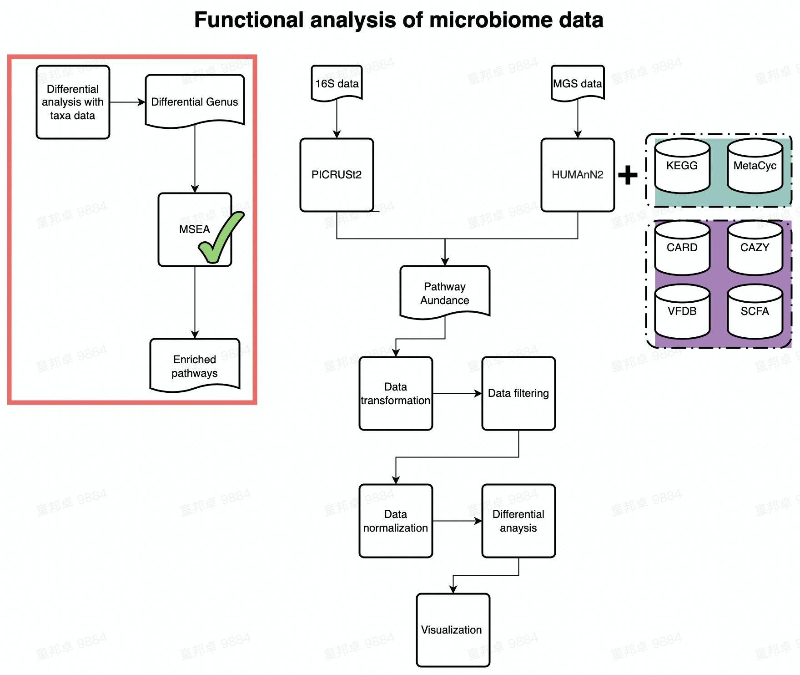

# MSEA

This is a markdown tutorial for MSEA. To run MSEA, you need to Install MSEA to your default python before running this template. Installation instruction: https://msea.readthedocs.io/en/latest/quickstart.html#installation.  

You can run MSEA when you have genus that you're interested in (e.g., DA genus), write all genus into one txt file, one genus per line and feed the file to MSEA as input.  



---

## Execute MSEA with python script on server

You can run MSEA analysis with MSEA_Run.py on server, one required parameters and two optional parameters need to be provided for the script:  

1. --input (Required), input genus list file for MSEA, one genus per line.  
2. --output (Optional), output csv file of MSEA result. Default testout.csv  
3. --PerturbationTimes (Optional), number of perturbation. Fisher's excat test has bias on group with large number of samples, MSEA uses random sampling to remove the bias. Larger number of perturbation would cause longer runtime. Default 50.  
For more detail, see *[citation](https://www.nature.com/articles/s41598-020-78511-y)*

```markdown

/home/tongbangzhuo/Software/miniconda3/bin/python ./MSEA/MSEA_Run.py --input ./MSEA/test_input --output ./MSEA/testout.csv --PerturbationTimes 10

```

---

## Environment setup  

```markdown
library(dplyr)
library(magrittr)
library(ggplot2)
library(ggbipart)
library(stringr)
library(tibble)
library(wesanderson)

```

```{r environment setup, echo = FALSE, message=FALSE}
library(dplyr)
library(magrittr)
library(ggplot2)
library(ggbipart)
library(stringr)
library(tibble)
library(wesanderson)

```

## Read in MSEA result

```{r read MSEA result}

MSEA_res = read.csv('/share/projects/SOP/Functional_Analysis/github/Functional_analysis/MSEA/testout.csv', sep = '\t')
head(MSEA_res, n=3)
```

As the table shown above, MSEA result has 8 columns:  

1. term, human gene names.  
2. oddsratio. Odds ratio (Effect size) of the association between human gene and microbial Genus.  
3. pvalue. p value of Fisher's exact test.  
4. qvalue. q value of Fisher's exact test. FDR Benjamini-Hochberg correction applied.  
5. zscore. z-score measuring the deviation in expected ranks.  
6. combined_score. $c = log_{10}(p)*z$.  
7. shared. Genus associated with the human gene.  
8. n_shared. Number of genus associated with the human gene.  

---

## Filter MSEA result

```{r Filter MSEA}
## Filter MSEA result with qvalue
MSEA_res %<>% filter(qvalue < 0.05)


## Draw bipartite with top 10 combined_score human genes

## Define data transforming function
Transform_data <- function(df){
  All_Genus_in_res <- df$shared %>% unlist() %>% str_remove_all('\\[') %>% str_remove_all('\\]') %>% str_remove_all("'") %>% str_split(', ') %>% unlist() %>% unique()
  lst <- list()
  for (i in All_Genus_in_res){
    count_vec <- c()
    for (j in (1:nrow(df))){
      target_string = df[j,'shared']  %>% str_remove_all('\\[') %>% str_remove_all('\\]') %>% str_remove_all("'") %>% str_split(', ') %>% unlist()
      count = sum(i == target_string)
      count_vec <- c(count_vec, count)
    }
    lst[[i]] <- count_vec
  }
  bipartite_tbl <- cbind(df, as.data.frame(lst)) %>% dplyr::select(term, all_of(All_Genus_in_res)) %>% column_to_rownames('term')
  return(bipartite_tbl)
}

## Select top 10 human genes
Top_MSEA_res <- MSEA_res[1:10,]
```

---

## Visualization  

_**Draw bipartit graph to show the relation between human genes and microbial Genus with ggnet.**_  

```{r bipartit graph}
## Generate data for bipartit graph
bipartite_tbl <- Transform_data(Top_MSEA_res)

## Define network layout
mymat <- bipartite_tbl
coordP <- cbind(rep(2, dim(mymat)[1]), seq(1, dim(mymat)[1]) + 
        2)
coordA <- cbind(rep(4, dim(mymat)[2]), seq(1, dim(mymat)[2]) + 
        2)

mylayout <- as.matrix(rbind(coordP, coordA))

## Construct network content
test.net <- bip_init_network(mymat, mode1 = 'HumanGenes',mode2 = 'MicrobialGenus')

# Define groups of network nodes
test.net %v% "Group" = get.vertex.attribute(test.net, attrname="mode")

# Draw network
p <- GGally::ggnet2(test.net, mode = mylayout,
               label = T, size = "degree",
               color = 'Group', shape = 'Group',
               label.size = 5, layout.exp = 1.5, alpha = 0.75) +
  scale_colour_manual(values = wes_palette("FantasticFox1")) + 
  guides(color=guide_legend("Group"))

p
```

---

## Run enrichR analysis 

After acquiring genus-associated human genes, you can run enrich your genes on different databases by enrichR.  
The next chunk shows you how to run enrichR on R studio, you can either run enrichR on their interactive *[website](https://maayanlab.cloud/Enrichr/)*.  


```{r enrichR}
library(enrichR)

## List available types of databases
listEnrichrSites()

## Choose database of Human genes
setEnrichrSite("Enrichr")

## List available database
websiteLive <- TRUE
dbs <- listEnrichrDbs()
if (is.null(dbs)) websiteLive <- FALSE
if (websiteLive) head(dbs)

## Choose the databases you want to enrich your genes with and Run enrichR of genus-associated human genes on chosen databases
dbs <- c("GO_Molecular_Function_2021","KEGG_2019_Human")
if (websiteLive) {
    enriched <- enrichr(MSEA_res$term %>% as.vector(), dbs)
}

## Show first few rows of enrichment result
Kegg_res <- enriched[['KEGG_2019_Human']]
head(Kegg_res)

GO_res <- enriched[['GO_Molecular_Function_2021']]
head(GO_res)

## Plot Enrichment result
p <- plotEnrich(enriched[['KEGG_2019_Human']] %>% filter(Adjusted.P.value < 0.05),
           showTerms = 20, numChar = 40, y = "Count", orderBy = "P.value") + 
  scale_fill_gradientn(colours = rev(wes_palette("Zissou1", 10, type = "continuous")))


p
```

As shown above, Y axis shows the enriched terms of your input genes. X axis shows the number of input genes in the enriched terms.

---

## Session info

```{r session info msea}
devtools::session_info()
```