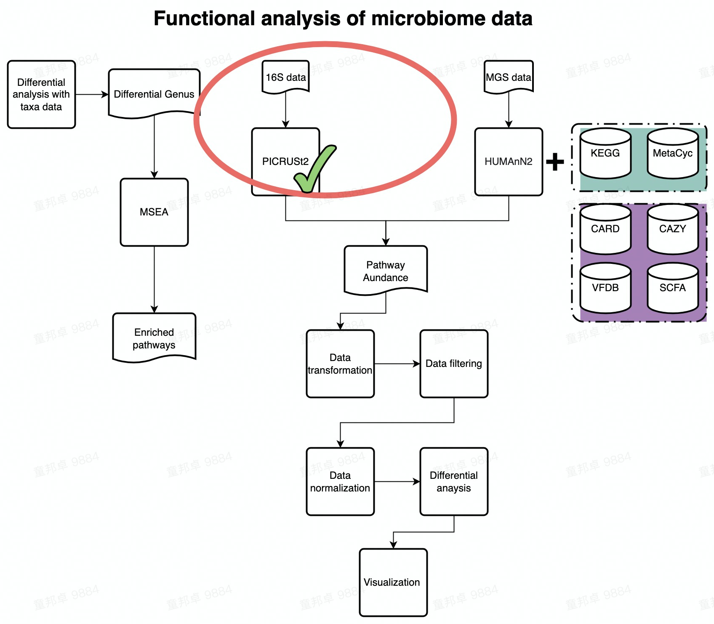
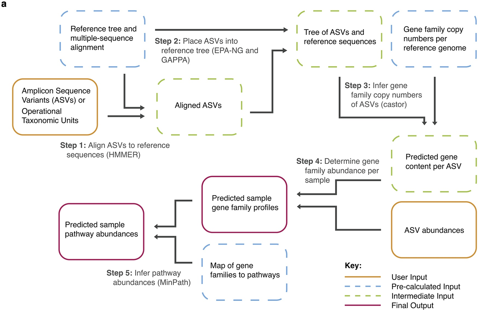

# PICRUSt2

_**This demo would guide you how to implement funciton analysis on 16S data**_  



---

**PICRUSt2 algorithm**

The Picture below shows the algorithm of PICRUSt2. Please find details on https://github.com/picrust/picrust2/wiki.  

  
(a) The PICRUSt2 method consists of phylogenetic placement, hidden-state-prediction and sample-wise gene and pathway abundance tabulation. ASV sequences and abundances are taken as input, and gene family and pathway abundances are output. All necessary reference tree and trait databases for the default workflow are included in the PICRUSt2 implementation.  

---

## Environment Setup  

Pull docker image of picrust2(authored by zhangzhikuan@xbiome.com) from server. You can skip this step if you have pulled docker image of picrust2 on your server already.  

```markdown
docker pull harbor.xbiome.com/xbiome/environments/picrust2:v2.4.1-03d011a
```

---

## Run PICRUSt2  

Run PICRUSt2 on 16S data.  If you have run PICRUSt2 and generated output files from PICRUSt2 already, please jump to [Interpret result table from PICRUSt2](#interpret-result-table-from-picrust2).

Check the required parameters of PICRUSt2 docker image.  

```{bash}
docker run -i --rm -u $(id -u):$(id -g) -v /home/tongbangzhuo/tongbangzhuo_Xbiome1/Project/PICRUSt2/:/in harbor.xbiome.com/xbiome/environments/picrust2:v2.4.1-03d011a bash -c "python picrust2_main.py --help"
```

**Three parameters are required:**  

- **INPUTDIR**, specify your dada2 output folder as the input of picrust2 docker image.  
- **OUTPUTDIR**, specify the output dirctory. Don't create the output folder your self, picrust2 docker image would take care of it.  
- **PARAM**, config files of running picrust2 docker image. Usually use the default file in docker image: /opt/test/parameter_default.json  

The whole process might take hours to finish. Demo data (3970 ASVs took approximately 1 hour)  

```markdown
docker run -i --rm -u $(id -u):$(id -g) -v /home/tongbangzhuo/tongbangzhuo_Xbiome1/Project/PICRUSt2/:/in harbor.xbiome.com/xbiome/environments/picrust2:v2.4.1-03d011a bash -c "python picrust2_main.py -i /in/Demodata/ -o /in/output/ -p /opt/test/parameter_default.json"
```

---

## Interpret result table from PICRUSt2  

There are many possible ways to analyze the PICRUSt2 output. STAMP is one tool that can be used that requires no background in scripting languages. This tool is very useful for visualizing microbiome data, but **note that there are better alternatives for conducting statistical tests with compositional data (such as the ALDEx2 R package)**. If you would like to try out STAMP for visualizing the PICRUSt2 output, see [here](https://github.com/picrust/picrust2/wiki/STAMP-example).

No matter what analysis approach you take, you should be aware that **results based on differential abundance testing can vary substantially between shotgun metagenomics sequencing data and amplicon-based metagenome predictions based on the same samples. This is especially true for community-wide pathway predictions.** Please check out [this post](https://github.com/picrust/picrust2/wiki/Major-Bug-Reports-and-Announcements#updated-biorxiv-pre-print-and-major-caveats-highlighted) and [this response](https://github.com/picrust/picrust2/wiki/Frequently-Asked-Questions#how-should-i-analyze-the-picrust2-output) to a FAQ for more details.  

_**But here, we carry out DA on  KO profile table predicted from PICRUSt2 as demo.**_

### Read input  

Read profile table from PICRUSt2 result

```{r read KO profile, warning=FALSE}
## Load aldex
library(ALDEx2)
library(tibble)
library(magrittr)
library(phyloseq)

KO_profile <- read.table('/share/projects/SOP/Functional_Analysis/Tongbangzhuo/Demodata/PICRUSt2/output/KO_metagenome_out/pred_metagenome_unstrat.tsv',
                         sep = '\t', comment.char = '', na.strings = '', header = TRUE, check.names = FALSE)
head(KO_profile)

dim(KO_profile)

metadata <- readxl::read_xlsx('/share/projects/SOP/Functional_Analysis/Tongbangzhuo/Demodata/PICRUSt2/Demodata/Eround1_Animal_metadata.xlsx') %>% as.data.frame() %>% column_to_rownames('SampleID')

## Construct phyloseq object of functional data
phy <- phyloseq::phyloseq(otu_table(KO_profile %>% column_to_rownames('function'), taxa_are_rows = TRUE),
         sample_data(metadata))
```

### Data Preprocess (Picrust2)

#### Data transformation (Picrust2)

In this chunk, we use TSS (Total sum scaling) to eliminate the influence of sequencing depth on samples.  Alternatively, you can use rarefied 16s data as input for Picrust2 in [Run PICRUSt2](#run-picrust2) to eliminate the sequencing depth differences among samples. If rarefied 16s data is used, please jump to [Filter low prevalence pathway](#filter-low-prevalence-pathway-picrust2) chunk directly.

```{r normalize KO profile, warning=FALSE}
## Normalize into relative abundance
phy_ra <- XMAS2::normalize(object = phy,
                 method = "TSS")

head(otu_table(phy_ra))
```

#### Aggregate low abundance data (Picrust2)

In this chunck, we aggregate low abundance features to one row. **Note: you need to [transform](#data-transformation-picrust2) your data before running this chunk!!**  

_1e-12 is an empirical threshold fot filtering low abundance feature. According to published paper [Obese Individuals with and without Type 2 Diabetes Show Different Gut Microbial Functional Capacity and Composition](https://doi.org/10.1016/j.chom.2019.07.004)  
pathway with top 50% mean abundance and top 50% variance are left. But in MaAsLin2，pathway with abundance less than 10-10 are filtered by default._  

```{r filter low abundance KO profile}
source("/share/projects/SOP/Functional_Analysis/Tongbangzhuo/Phase1/Kegg/Scripts/R/ultility.R")

filtered_KO_profile <- aggregate_low_abundance(input_data = otu_table(phy_ra) %>% as.data.frame(),
                                                           threshold = 1e-12) ## threshold should be modified based on your on study

dim(filtered_KO_profile)

filtered_phy_ra <- phyloseq::phyloseq(otu_table(filtered_KO_profile, taxa_are_rows = TRUE),
                            sample_data(metadata))

```

#### Filter low prevalence pathway (Picrust2)

In this chunk, we remove pathways appearing in less than 5% of samples from data set before doing analysis.  
**Note: Run [Data transformation](#data-transformation-picrust2) and [Aggregate low abundance data](#aggregate-low-abundance-data-picrust2) before running this chunk!**  

```{r filter low prevalence KO profile, warning=FALSE}

## Filter features whose frequency are less than 0.05. 
filtered_phy_ra <- XMAS2::run_trim(object = filtered_phy_ra, cutoff = 0.05, trim = "feature")

dim(otu_table(filtered_phy_ra))

```

#### Run DA  

Run CLR transformed wilcoxon DA.  
**Remember to [Preprocess your data](#data-preprocess-picrust2) before running this chunk!**  

```{r run DA on KO profile, warning=FALSE}

## Run DA
DA_res <- XMAS2::run_wilcox(
                    ps = filtered_phy_ra,
                    group = "Group2",
                    group_names = c("Baseline", "Treatment"),
                    norm = "CLR")

head(DA_res)

```

#### Visualize DA result  

```{r Visualize DA result, fig.width= 20, fig.height=9, warning=FALSE}
## Read in description for 
ID_Description_Mapping <- read.table('/share/projects/SOP/Functional_Analysis/Tongbangzhuo/Demodata/PICRUSt2/output/KO_metagenome_out/pred_metagenome_unstrat_descrip.tsv',
                                     sep = '\t', comment.char = '', na.strings = '', quote = '', header = TRUE, check.names = FALSE) %>% .[, c(1,2)] %>% column_to_rownames('function')

renames_DA_res <- DA_res %>% dplyr::mutate(TaxaID = ID_Description_Mapping[DA_res$TaxaID,] %>% as.vector())

## Volcano plot
p <- XMAS2::plot_volcano(
    da_res = DA_res,
    group_names = c("Baseline", "Treatment"),
    x_index = "Log2FoldChange (Rank)\nBaseline_vs_Treatment",
    x_index_cutoff = 0.5,
    y_index = "AdjustedPvalue",
    y_index_cutoff = 0.05,
    group_color = c("red", "grey", "blue"),
    topN = 5,
    taxa_name = NULL)

p

filtered_DA_res <- DA_res %>% dplyr::arrange(`AdjustedPvalue`, `Log2FoldChange (Rank)\nBaseline_vs_Treatment`) %>% 
    dplyr::filter(`AdjustedPvalue` < 0.05) %>% dplyr::filter(abs(`Log2FoldChange (Rank)\nBaseline_vs_Treatment`) > 
                                                               0.5)

top_features <- filtered_DA_res[order(filtered_DA_res$AdjustedPvalue), ] %>% head(5) %>% .$TaxaID


## Boxplot
filtered_pf <- otu_table(filtered_phy_ra) %>% as.data.frame() %>% .[top_features, ] %>% rownames_to_column('feature') %>% dplyr::mutate(feature = ID_Description_Mapping[top_features, ]) %>% column_to_rownames('feature') %>% t() %>% as.data.frame()

filtered_pf %<>% cbind(., metadata)

XMAS2::plot_boxplot(data = filtered_pf,
             y_index = ID_Description_Mapping[top_features, ] %>% as.vector(),
             group = "Group2",
             group_names = c('Treatment','Baseline'),
             do_test = TRUE,
             method = "wilcox.test")


```

Same analysis can be applied to the EC profile, KEGG pathway profile as well as Metacyc pathway profile.  

---

## Session info

```{r session info picrust2}
devtools::session_info()
```
