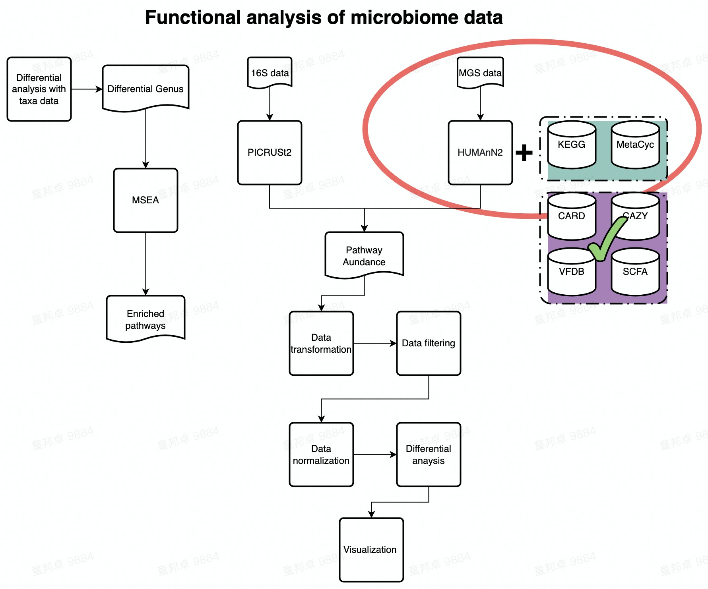

# Functional Analysis of TargetDatabase

(This script was written in _**/share/projects/SOP/Functional_Analysis/github/Functional_analysis/**_ , all relative paths below are under this complete path.)

_**This demo guides you how to analyze the pathway profile annotated from humman2 against 7 target databases.**_  



---

## Environment setup

```{r setup, echo=FALSE, message=FALSE}
knitr::opts_chunk$set(echo = TRUE)

## Load requeired packages
library(tibble)
library(phyloseq)
library(stringr)
library(xviz)
library(reshape2)
library(magrittr)
library(dplyr)
library(pathview)

## Load functions
source("./RScripts/ultility.R")
```

---

## Data loading

_**Since the format of pathway profile annotated in 7 target databases are almost identical, We use card data as an example.**_

Same as kegg pathway data, we normalize data at the begining of analysis to reduce the differences of sequencing depth across all samples.

_**Read in card data**_

```{r rescale card data}
## Read in merged card profile data

merged_card_profile <- read.table('./Demodata/TargetDatabase/Demo_data/merged_card_profile.tsv',
                                  sep = '\t', header = TRUE, check.names = FALSE, na.strings = '?',comment.char = '?')

head(merged_card_profile, n = 2)

## Read in metadata (Group information)

metadata <- read.table('./Demodata/TargetDatabase/Demo_data/Demo_metadata.xls', check.names = FALSE, header = TRUE)
```

---

## Data preprocessing

_**Split strain info**_

```{r Split strain info}
## Split strain info. Profile generated from humann2 has species information, thus we need to extract them.
## Straintified profile

straintified_merged_card_profile <- merged_card_profile[grep('\\|s_', merged_card_profile$ID),]

head(straintified_merged_card_profile, n = 2)

## Exclude Strain info

merged_card_profile <- merged_card_profile[grep('\\|s_', merged_card_profile$ID, invert = TRUE),]

head(merged_card_profile, n = 2)

rownames(straintified_merged_card_profile) <- NULL
rownames(merged_card_profile) <- NULL
```

_**Transforming data**_  

```{r TSS transformation}
rescaled_merged_card_profile <- merged_card_profile %>% column_to_rownames('ID') %>% apply(., 2, function(x) x/sum(x)) %>% as.data.frame()

head(rescaled_merged_card_profile, n = 2)
```

_**Remove unppaed pathways**_  

```{r remove unmapped features}
## In this chunk, we remove the umapped row in rescaled profile table because we are not able to intepret UNMAPPED entry.

card_profile <- rescaled_merged_card_profile[grep("UNMAPPED", rownames(rescaled_merged_card_profile), invert = TRUE), ]

```

_**Aggregate low abundance data**_  

In this chunck, we aggregate low abundance features to one row.  
_**1e-12 is an empirical threshold fot filtering low abundance feature. According to published paper [Obese Individuals with and without Type 2 Diabetes Show Different Gut Microbial Functional Capacity and Composition](https://doi.org/10.1016/j.chom.2019.07.004), pathway with top 50% mean abundance and top 50% variance are left. But in MaAsLin2，pathway with abundance less than 10-10 are filtered by default.**_  

```{r filter}

Filtered_card_profile <- aggregate_low_abundance(input_data = card_profile,
                                                           threshold = 1e-12) ## threshold should be modified based on your on study

head(Filtered_card_profile)

```

---

### Standard analysis

_**Compositional barplot**_

```{r Compositional barplot, fig.width = 6, fig.height = 9}
## In this chunk, we construct stacked pathway barplot to depict the pathway composition of samples, we use function plot_stacked_bar from xviz to plot.
## In case there are too much entries, we use parameter "collapse" in plot_stacked_bar function to integrate entries whose abundance are below given threshold into "Others".
## Note: Adjust your graph size to show complete graph.

compositional_plt <- xviz::plot_stacked_bar(otu_table = Filtered_card_profile %>% t() %>% as.data.frame(),
                 metadata = metadata, collapse = 0.01) + theme(axis.text.x = element_text(vjust = 1))

compositional_plt
```

_**Beta diversity**_

```{r Beta diversity}
## In this chunk, we inherit the concept of Beta diversity of microbial taxa data and apply it to pathway data to explore the similarity between samples.

## construct phyloseq for beta diversity analysis

tmp_phyloseq <- phyloseq(otu_table(Filtered_card_profile, taxa_are_rows = TRUE),
                         sample_data(metadata))


## PCoA plot
PCOA_plot <- xviz::plot_beta_diversity(phyloseq = tmp_phyloseq,
                                       feature = 'group',
                                       method = 'bray',
                                       label = TRUE)
print(PCOA_plot)


## PERMANOVA test & beta dispersion test
## We use PERMANOVA test to check the differences of function composition among different groups. Additionally, we also take homogeneity of group variance into consideration.

dispersion_permanova_res <- run_permanova_betadisp(physeq = tmp_phyloseq,
                                                   vars = 'group'
                                                   )

dispersion_permanova_res

```

---

## Differential analysis(DA)

_**Filter low prevalence pathway**_  

Low prevalence pathways are pathways only occur in minor samples.
In this chunk, we would remove pathways apperaing in less than max(2 , 5% of samples) from data set before doing analysis. **Remember to run all three chunks in data preprocessing section before running this chunk!**  

```{r Filter low prevalence pathway}

print(paste0(nrow(Filtered_card_profile), ' entries before filtering low prevalence data'))

Filtered_card_profile <- filter_prevalence(otu_table = Filtered_card_profile,
                  threshold = 0.05,
                  taxa_are_rows = TRUE
                  )

head(Filtered_card_profile, n =2)

print(paste0(nrow(Filtered_card_profile), ' entries After filtering low prevalence data'))

```

_**DA with LM**_

```{r DA}
## In this chunk, you would be using logistic regression model to find pathways that are significantly enriched in certain group.

## Due to the nature of compositional data, we cannot apply linear models to compositional data directly. 
## Transformation of relative abundance data should be carried out before feeding the data to LM.
## Here, we add a very small value (1e-12) to the pathway profile table to avoid genrating NA during transformation, then use logit transformation to transform data. And eventually we apply LM to the transformed data

## Adding small value to the profile table (The value is arbitrary).

DA_card_profile <- Filtered_card_profile + 1e-12

## Reshape profile data table and use logit transformation.

DA_card_profile <- DA_card_profile %>% t() %>% as.data.frame() %>% rownames_to_column('SeqID') %>% as.data.frame()
DA_metadata <- metadata %>% rownames_to_column('SeqID') %>% as.data.frame()

## Reshape dataframe into long table
DA_input <- merge(DA_card_profile, DA_metadata, by='SeqID') %>% reshape2::melt(value.name = 'RA',
                                                                                         variable.name = 'PathwayIDs')

## Logit transformation
DA_input %<>% mutate(RA_logit = log(RA/(1-RA)))

## Fit data to LM
## Loop over each pathway in two groups
LM_res <- DA_input %>%  split(.$PathwayIDs) %>% lapply(., function(x){
  gml_res_summary <- lm(data = x, formula = RA_logit ~ group) %>% summary() %>% .$coefficients %>% as.matrix() %>% as.data.frame() %>% rownames_to_column(var = "Factors")
  }
)

## Merge all result in one table
LM_res <- LM_res %>% data.table::rbindlist(idcol = "PathwayID") %>% filter(Factors != "(Intercept)")

## Adjust p value using p.adjust function from stats package, you could choose different adjust method.
LM_res %<>% mutate(adjust.p  = stats::p.adjust(.$`Pr(>|t|)`,
                                               method = 'BH'))

## Calculate effect size (Odds ratio) of each feature
LM_res %<>% mutate(OR = exp(Estimate)) %>% as.data.frame()

head(LM_res)

```

_**Show DA result with volcano plot**_

```{r visualize DA result by volcano plot}
## Plot volcano plot to show effect size (x-axis) and p value (y-axis) of pathways.
## Here we only tend to hightlight pathways that satisfy adjust.p < 0.05 and (OR < 0.2 | OR > 0.5) at the same time.
## You can nevertheless choose different threshold accroding to your own data.

volcano_plot <- LM_res %>% mutate(p.log = -log10(`Pr(>|t|)`), log10OR = log10(OR)) %>%
    ggplot(aes(x = log10OR, y = p.log)) +
    geom_point(size = 0.5) +
    geom_point(size = 0.5, color = "red", data = . %>% filter(`Pr(>|t|)` < 0.05 & (OR < 0.2 | OR > 0.5))) + 
    theme_bw() + 
    geom_vline(xintercept = log10(c(0.05, 0.1, 0.2, 0.5, 1, 2)), size = 0.05, color = "grey") +
    geom_hline(yintercept = -log10(c(0.7)), size = 0.05, color = "grey") +
    theme(aspect.ratio = 1,
          panel.grid.minor = element_blank(),
          panel.grid.major.x = element_blank()
          ) +
    labs(x = "Estimated Odds Ratio", y = "FDR p-values(-log10)")

print(volcano_plot)

```
