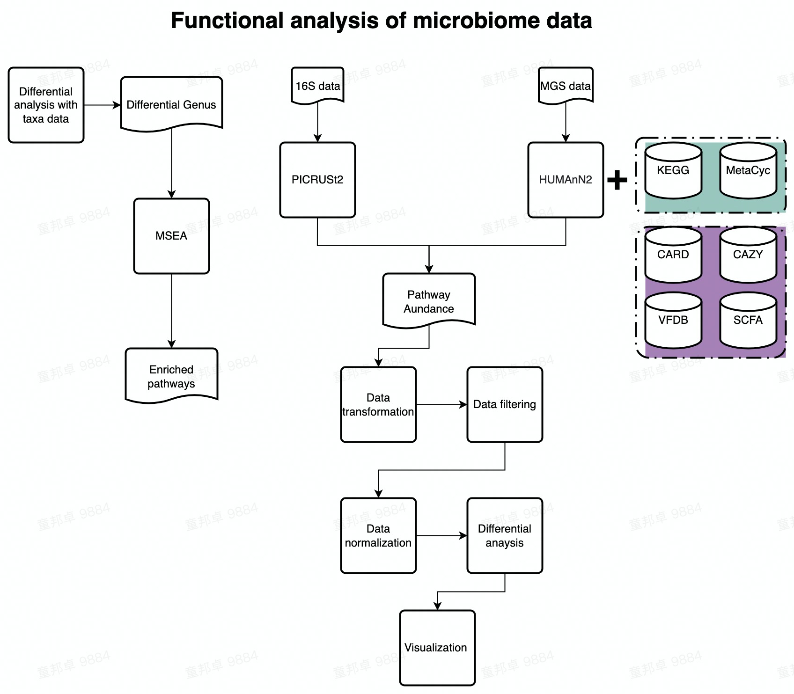

--- 
title: "Functional analysis"
author: "Bangzhuo Tong"
date: "`r Sys.Date()`"
site: bookdown::bookdown_site
output: bookdown::gitbook
documentclass: book
bibliography: [assets/book.bib, assets/packages.bib]
biblio-style: apalike
link-citations: yes
always_allow_html: true
description: "Tutorial for MGS functional analysis"
---

# Introduction

---

**This is a tutorial introducing the analysis of microbiome functional data.**

Flowchart of this tutorial:  

  

---

_**MGS data of two cohorts were used as demo data throughout the first 6 chapters in this tutorial.**_  

One cohort contains 13 samples of 6 patients in GvHD project.  

The other cohort consist of 10 samples from 8 patients, 1 water tube and 1 BRS in Newtech project.  

The first cohort was used as the input data for MetaCyc database analysis and the other one was used as the input for the analysis of KEGG, VFDB, SCFA, CARD, CAZY databases.  

_**16S data of mouse fecal samples from BeiZhong E round project was used as demo data in Chapter 8 (PICRUSt2).**_  

_**Notably, only Genus names should be used as input in Chapter 7 for MSEA analysis.**_  

---

This book includes 8 Chapters of the following 5 modules on funcitonal analysis:  

**5 modules include:**  

- Analysis of Metacyc data  

- Analysis of KEGG data  

- Analysis of target database data  

- MSEA  

- PICRUSt2  

---

**8 Chapters include:**  

- Chapter1, introducing basic information of this tutorial.  

- Chapter2, introducing the analysis of Metacyc data.  

- Chapter3, introducing the preprocesssing (How to merge data of multiple samples and convert kegg genes to kegg pathways, etc,.) of KEGG data.  

- Chapter4, introducing the analysis of processed KEGG data.  

- Chapter5, introducing the preprocesssing (How to merge data of multiple samples) of VFDB, SCFA, CARD, CAZY data.  

- Chapter6, introducing the analysis of processed CARD data.  

- Chapter7, introducing MSEA.  

- Chapter8, introducing PICRUSt2 analysis of 16S data.  